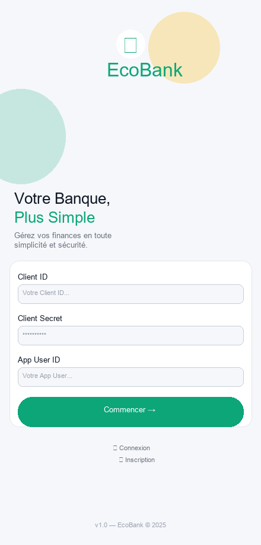
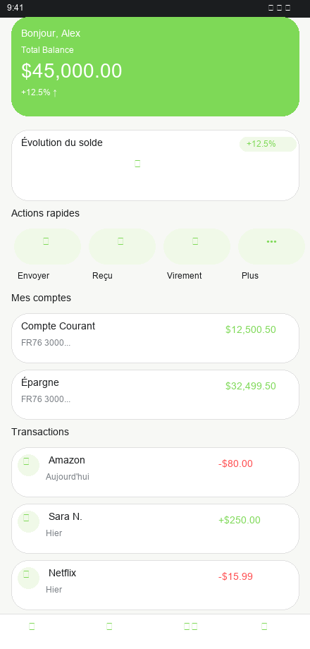

# EcoBank

Application bancaire multi-plateformes en **Avalonia .NET 10**, basée sur les APIs **Xpollens**.

## 🎨 Design Officiel EcoBank Appliqué

Toutes les pages utilisent la **palette officielle EcoBank**:
- **Palette primaire** : Vert clair `#7ED957` (boutons, titres, héros)
- **Palette accent** : Jaune acide `#C6FF00` (highlights, badges)
- **Palettes neutres** : Background `#F7F8F5`, Cards `#FFFFFF`
- **Typographie** : Inter / SF Pro, weights 400/700
- **Composants** : Buttons pill (28px), Cards (24px), Shadows officielles
- **Layout** : Responsive mobile-first
- **Accessibilité** : WCAG AA+ compliant
- **Theme** : Light theme uniquement

### Pages Redesignées
- ✅ **Login** : Authentification moderne avec palette verte
- ✅ **Home** : Dashboard avec héros vert, actions rapides, accounts, transactions





## Plateformes cibles

| Plateforme | Projet | TFM |
|---|---|---|
| Windows / macOS / Linux | `src/Desktop` | `net10.0` |
| Android | `src/Android` | `net10.0-android` |
| iOS | `src/iOS` | `net10.0-ios` |
| Browser (WASM) | `src/Browser` | `net10.0-browser` |

## Architecture

```
EcoBank/
├── src/
│   ├── App/                        # Bibliothèque partagée (UI, ViewModels, Services)
│   │   ├── Views/                  # Écrans AXAML (Auth, Home, Accounts, Operations, Cards, Profile)
│   │   ├── ViewModels/             # ViewModels MVVM (CommunityToolkit.Mvvm)
│   │   ├── Services/               # NavigationService, ISecureStorage
│   │   └── Styles/                 # Tokens.axaml, Components.axaml (design system)
│   ├── Core/                       # Domaine métier (sans dépendances UI)
│   │   ├── Domain/                 # Entités : User, Account, Operation, Card
│   │   ├── Ports/                  # Interfaces : IAuthService, IAccountRepository…
│   │   ├── UseCases/               # Cas d'usage : Authenticate, GetAccounts…
│   │   └── Application/            # UserContext (state partagé)
│   ├── Infrastructure.Xpollens/    # Adaptateurs HTTP vers l'API Xpollens
│   │   ├── Auth/                   # XpollensAuthService
│   │   ├── Http/                   # AuthenticatedHandler, CorrelationIdHandler, LoggingHandler
│   │   ├── Accounts/Users/Operations/Cards/
│   │   └── DependencyInjection.cs
│   ├── Shared/                     # Design tokens JSON
│   ├── Desktop/                    # Point d'entrée Desktop (Program.cs)
│   ├── Android/                    # Point d'entrée Android (MainActivity.cs)
│   ├── iOS/                        # Point d'entrée iOS (AppDelegate.cs)
│   └── Browser/                    # Point d'entrée Browser/WASM (Program.cs)
└── EcoBank.slnx
```

## Parcours de navigation

1. **Connexion Xpollens** — Saisie Client ID / Client Secret → authentification OAuth2
2. **Sélection utilisateur** — Liste paginée avec recherche, statut KYC
3. **Shell principal** (responsive)
   - Navigation latérale sur tablette/desktop (≥ 600 px)
   - Barre de navigation basse sur mobile (< 600 px)
4. **Onglets** : Accueil · Comptes · Opérations · Cartes · Profil

## Design System

Les tokens sont définis dans `src/App/Styles/Tokens.axaml` (ResourceDictionary) et `src/App/Styles/Components.axaml` (Styles).

### Palette officielle EcoBank

**Couleurs principales** :
- Primary (Green) : `#7ED957` - Boutons, titres accentués
- Primary Dark : `#1E7F4F` - Success states
- Accent (Yellow) : `#C6FF00` - Éléments décoratifs
- Background : `#F7F8F5` - Page background
- Card Background : `#FFFFFF` - Cartes
- Text Primary : `#1B1D1F` - Texte principal
- Text Secondary : `#7A7F85` - Texte secondaire
- Danger : `#FF4D4F` - États d'erreur
- **Dark mode** : Désactivé pour maintenant

**Espacement** : Grille 4dp (xs=4, sm=8, md=16, lg=24, xl=32)

**Border Radius** :
- Card : 24px
- Button (pill) : 28px
- Small : 16px
- Autres : 4-12px

**Accessibilité** : Touch target minimum 48dp

### Styles de composants

| Classe | Utilisation | Couleur |
|--------|-------------|---------|
| `Button.Primary` | Bouton principal | `#7ED957` |
| `Button.PrimaryGreen` | Bouton action (identique à Primary) | `#7ED957` |
| `Button.Secondary` | Bouton secondaire (transparent) | - |
| `Button.Danger` | Bouton destructive | `#FF4D4F` |
| `TextBox.EcoField` | Champ de formulaire | - |
| `Border.Card` | Conteneur de contenu | Radius: 24px |
| `TextBlock.AmountCredit` | Montant crédit | `#1E7F4F` |
| `TextBlock.AmountDebit` | Montant débit | `#FF4D4F` |

## Lancer l'application (Desktop)

```bash
dotnet run --project src/Desktop/EcoBank.Desktop.csproj
```

## Construction

```bash
# Desktop
dotnet build src/Desktop/EcoBank.Desktop.csproj

# Android (nécessite le workload Android)
dotnet build src/Android/EcoBank.Android.csproj

# iOS (nécessite le workload iOS + Xcode)
dotnet build src/iOS/EcoBank.iOS.csproj

# Browser/WASM (nécessite le workload wasm-tools)
dotnet build src/Browser/EcoBank.Browser.csproj
```

## Sécurité

- Le `clientSecret` n'est **jamais** persisté en clair ni loggé
- Pipeline HTTP : injection du Bearer token + X-Correlation-ID + logging sans secrets
- Les endpoints Xpollens non documentés sont marqués `// TODO: confirm exact path`
