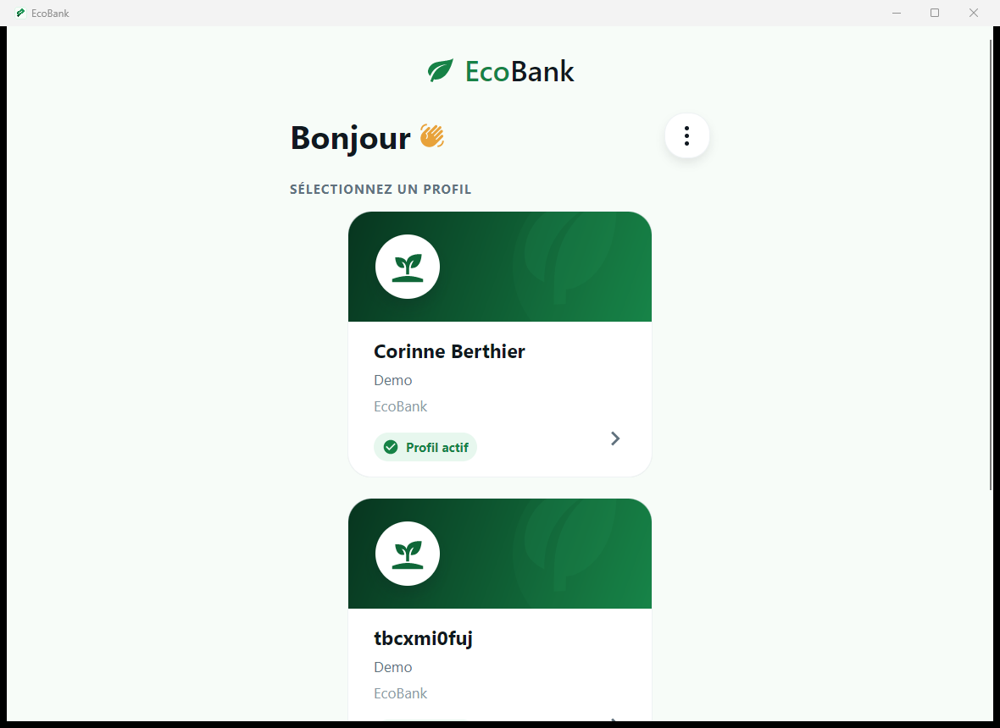
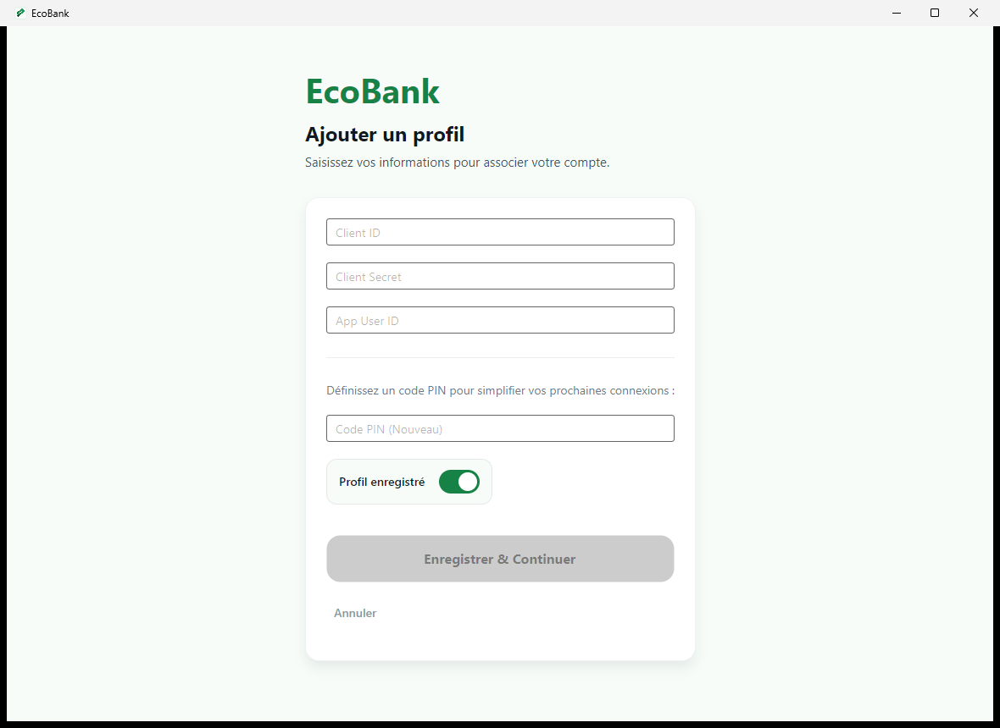
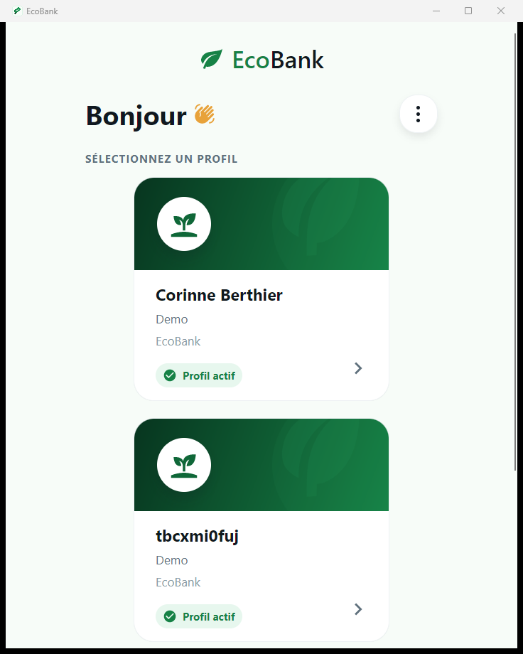
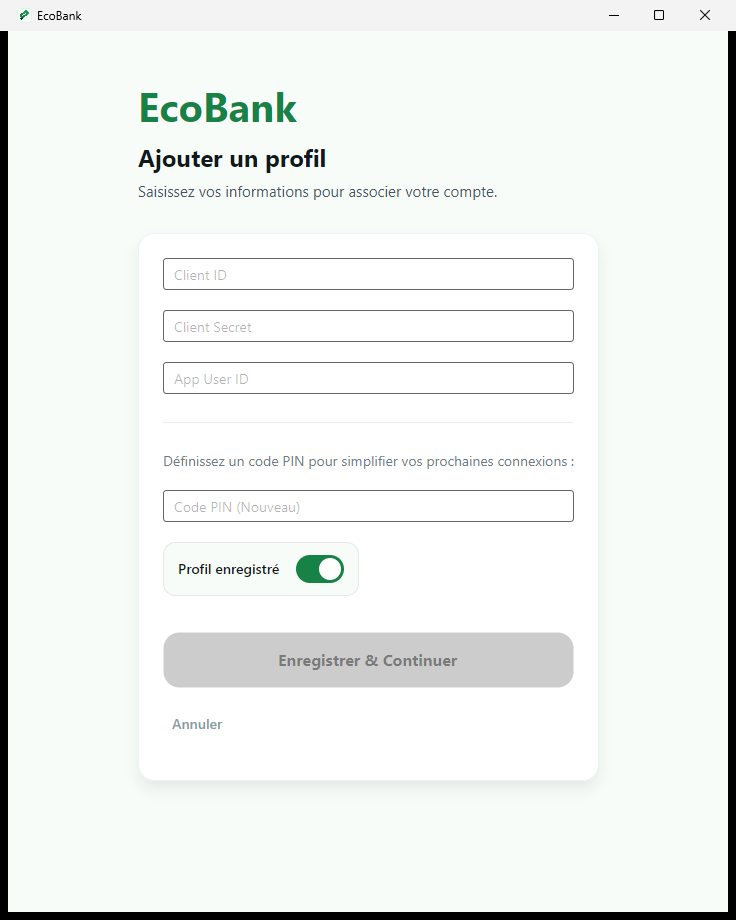
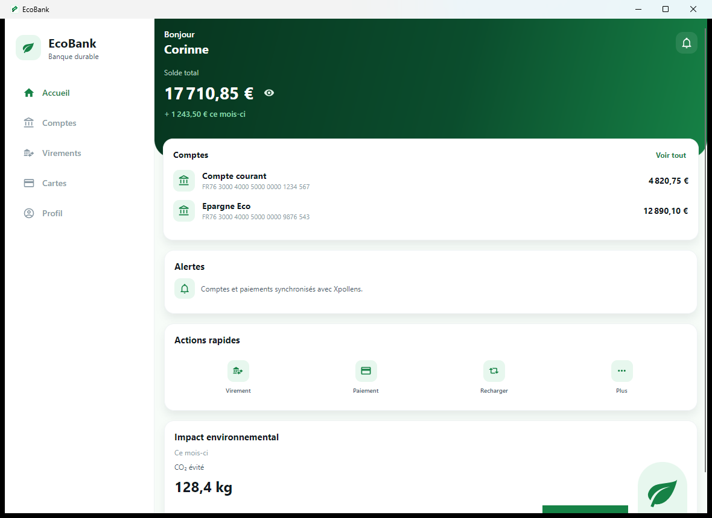
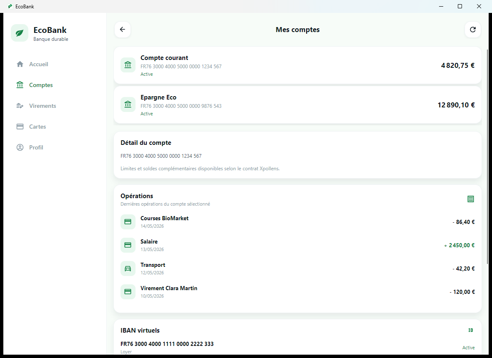
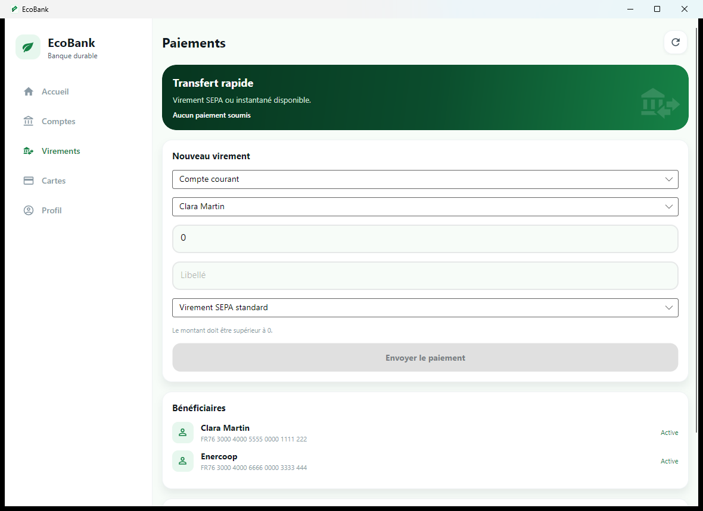
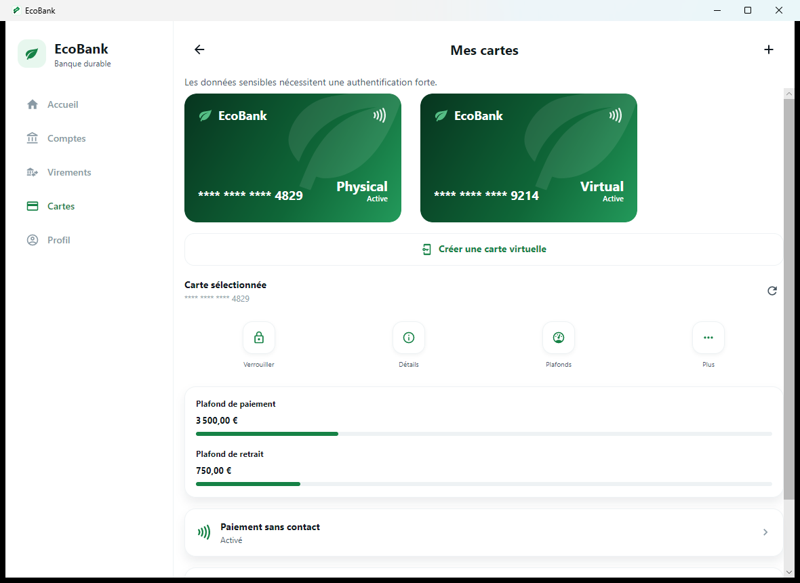
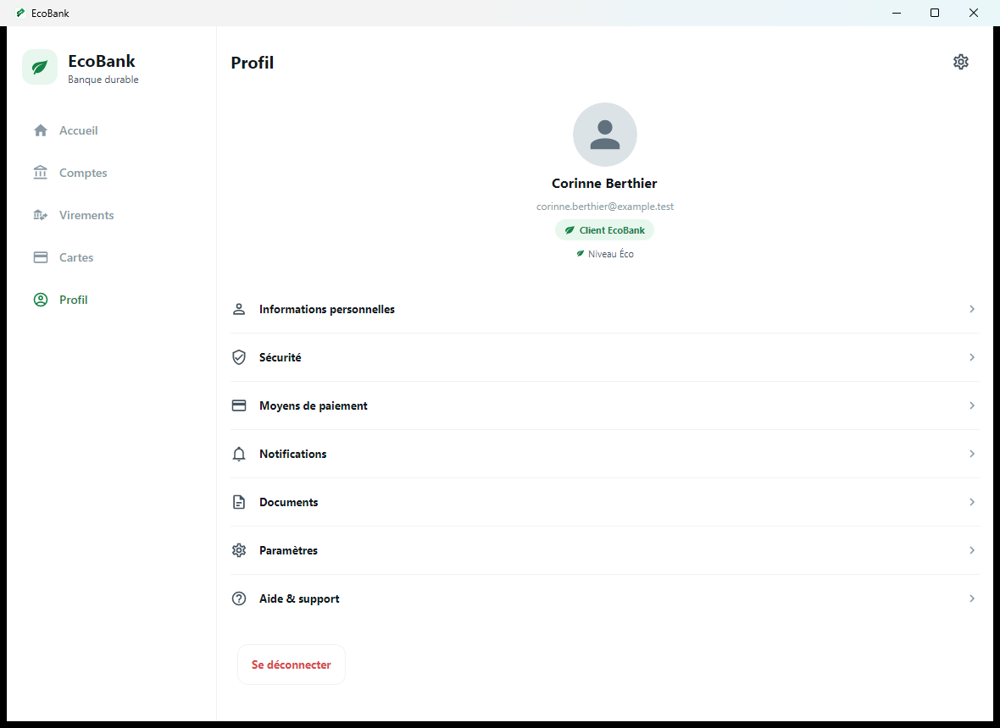

# EcoBank

EcoBank est une application bancaire multi-plateformes en **Avalonia .NET 10** connectée aux APIs sandbox **Xpollens**.

L'application cible un parcours client existant : connexion OAuth2 avec `clientId` / `clientSecret`, sélection ou association d'un `appUserId`, consultation des comptes, opérations, cartes, paiements et informations de profil.

## Aperçu

### Sélection de profil desktop



### Association de profil desktop



### Selection de profil Android / mobile



### Association de profil Android / mobile



### Fonctionnalites apres selection du profil











Des variantes compactes sont aussi disponibles pour les vues post-connexion :

| Vue | Capture compacte |
|---|---|
| Accueil | `docs/screenshot-feature-home-mobile.png` |
| Comptes | `docs/screenshot-feature-accounts-mobile.png` |
| Virements | `docs/screenshot-feature-payments-mobile.png` |
| Cartes | `docs/screenshot-feature-cards-mobile.png` |
| Profil | `docs/screenshot-feature-profile-mobile.png` |

Les captures ci-dessus utilisent le profil de demonstration fourni (`clientId=Demo`, `clientSecret=Demo`, `appUserId=72025cebA`) et des donnees bancaires de demonstration pour documenter le shell Avalonia partage.

## Fonctionnalités

- Authentification Xpollens OAuth2 avec gestion d'erreurs réseau et HTTP.
- Profils enregistrés localement avec secret chiffré AES-GCM et déverrouillage par PIN.
- Sélection d'un utilisateur Xpollens existant, sans parcours d'onboarding.
- Tableau de bord avec solde total, premier compte, alertes et dernières opérations.
- Comptes : soldes, IBANs virtuels, relevés bancaires et détail de compte.
- Opérations : liste paginée, statut, montant, libellé et détail.
- Virements : bénéficiaires, mandats, virement SEPA standard ou instantané.
- Cartes : cartes physiques et virtuelles, statut, limites, verrouillage, Apple Pay / XPay et demandes d'authentification forte.
- Profil : informations utilisateur, documents KYC disponibles et statut de sécurité.
- UI responsive : navigation latérale en desktop/tablette, navigation basse en mobile.

## Plateformes cibles

| Plateforme | Projet | TFM |
|---|---|---|
| Windows / macOS / Linux | `src/Desktop` | `net10.0` |
| Android | `src/Android` | `net10.0-android` |
| iOS | `src/iOS` | `net10.0-ios` |
| Browser / WebAssembly | `src/Browser` | `net10.0-browser` |

## Architecture

```text
EcoBank/
├── src/
│   ├── App/                        # UI Avalonia partagée, ViewModels, styles, services
│   │   ├── Views/                  # Auth, Shell, Home, Accounts, Operations, Cards, Profile
│   │   ├── ViewModels/             # MVVM avec CommunityToolkit.Mvvm
│   │   ├── Services/               # Navigation, stockage sécurisé, profils
│   │   └── Styles/                 # Tokens et composants visuels
│   ├── Core/                       # Domaine métier et cas d'usage
│   │   ├── Domain/                 # Users, Accounts, Operations, Cards, Payments, Documents
│   │   ├── Ports/                  # Interfaces des adaptateurs
│   │   ├── UseCases/               # Auth, Users, Accounts, Operations, Cards, Payments, Security
│   │   └── Application/            # UserContext partagé
│   ├── Infrastructure.Xpollens/    # Adaptateurs HTTP Xpollens
│   │   ├── Auth/                   # OAuth2 sandbox
│   │   ├── Http/                   # Bearer token, correlation id, logging filtré
│   │   └── Accounts, Cards, Documents, Operations, Payments, Security, Users
│   ├── Shared/                     # Tokens JSON partagés
│   ├── Desktop/                    # Point d'entrée desktop
│   ├── Android/                    # Point d'entrée Android
│   ├── iOS/                        # Point d'entrée iOS
│   └── Browser/                    # Point d'entrée WebAssembly
└── tests/
    └── EcoBank.App.Tests/          # Tests ViewModels et use cases
```

## Parcours utilisateur

1. **Ajouter ou choisir un profil** : saisie du `clientId`, `clientSecret`, `appUserId` et d'un PIN local.
2. **Connexion** : authentification OAuth2 via `https://sb-connect.xpollens.com/`.
3. **Chargement utilisateur** : récupération de l'utilisateur Xpollens ou fallback local si le profil n'est pas disponible.
4. **Shell bancaire** : onglets Accueil, Comptes, Virements, Cartes et Profil.
5. **Actions client** : consultation des comptes/opérations, préparation de virements, gestion des cartes et documents.

## Configuration de démonstration

Pour lancer le profil de test utilisé pour les captures :

```text
clientId: Demo
clientSecret: Demo
appUserId: 72025cebA
```

Le `clientSecret` n'est pas loggé et n'est persisté que si l'utilisateur active l'enregistrement du profil. Dans ce cas, il est chiffré localement et protégé par le PIN.

## Lancer l'application

### Desktop

```bash
dotnet run --project src/Desktop/EcoBank.Desktop.csproj
```

### Android

Le workload Android et un JDK 21 sont requis.

```bash
dotnet build src/Android/EcoBank.Android.csproj -c Debug
```

Si plusieurs JDK sont installés, forcez JDK 21 pour la commande :

```powershell
$env:JAVA_HOME = "C:\Program Files\Java\jdk-21.0.11"
$env:PATH = "$env:JAVA_HOME\bin;$env:PATH"
dotnet build src\Android\EcoBank.Android.csproj -c Debug
```

### Browser / WebAssembly

```bash
dotnet build src/Browser/EcoBank.Browser.csproj -c Debug
dotnet run --project src/Browser/EcoBank.Browser.csproj -c Debug
```

## Validation

```bash
dotnet build src/Desktop/EcoBank.Desktop.csproj -c Debug
dotnet build src/Android/EcoBank.Android.csproj -c Debug
dotnet test tests/EcoBank.App.Tests/EcoBank.App.Tests.csproj -c Debug
```

## Sécurité

- Secret client filtré des logs et jamais stocké en clair.
- Stockage local chiffré avec AES-GCM.
- PIN haché avec PBKDF2.
- Pipeline HTTP avec Bearer token, `X-Correlation-ID` et logging sans secrets.
- Authentification forte modélisée pour les actions carte sensibles.
